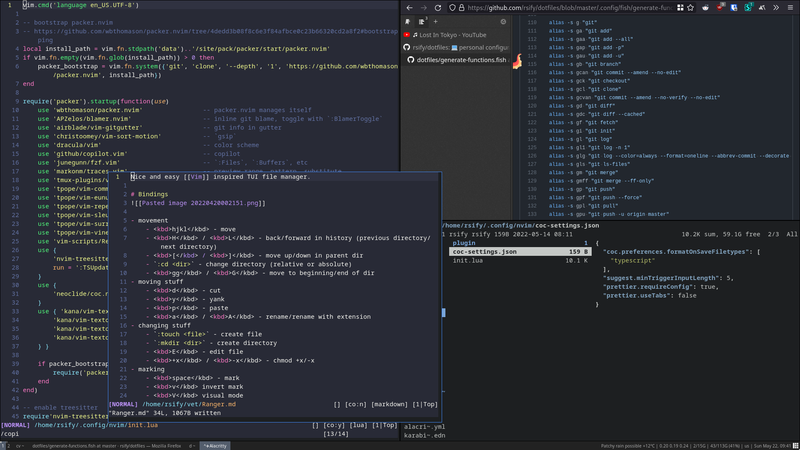

# Install
```bash
$ cd ~
$ git init
$ mv .git .dotfiles
$ alias dots "git --git-dir=$HOME/.dotfiles --work-tree=$HOME"
$ git remote add origin https://github.com/nikersify/dotfiles.git
$ git fetch
$ git reset --hard origin/master
$ git branch -u origin/master
$ git config status.showuntrackedfiles no

$ echo "<city-name>" > .config/private/current-city
```

# Shell
```bash
$ echo `which fish` | sudo tee /etc/shells
$ chsh -s `which fish`
# relog to switch login shells
```

# Node
- Download a node binary (https://nodejs.org/en/download)
- Add its `bin/` to path (fish: ``PATH=$PATH:`pwd`/bin``)
- `npx n lts` (or whatever version)

# Deps
```bash
$ brew leaves
autojump bat coreutils deno exa ffmpeg findutils fish fzf git gnupg hub insect jo jq libvterm lua ncdu neovim nghttp2 ranger ripgrep the_silver_searcher tmux wget youtube-dl
```
